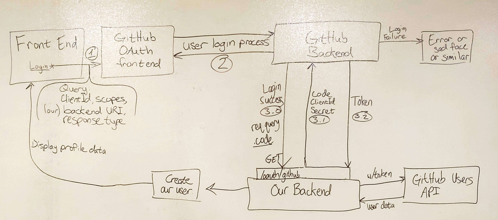

# LAB - 12

## Authorization Server - Back-end

### Author: Jesse Van Volkinburg && Bonnie Wang

### Links and Resources
* [submission PR](https://github.com/401-advanced-javascript-jv/12-auth-server/pull/1)
* [travis](https://www.travis-ci.com/401-advanced-javascript-jv/12-auth-server)
* [back-end](http://lab12auth.herokuapp.com/)
* [front-end](http://lab-12-jb.herokuapp.com/)

### Setup
#### `.env` requirements
* `PORT` - Port Number - Note these CANNOT be the same for both front-end and back-end
* `MONGODB_URI` - URL to the running mongo instance/db
* `GITHUB_CLIENT_ID` - OAuth client ID from Github
* `GITHUB_CLIENT_SECRET` - OAuth client secret from Github

#### Running the app
##### Back-End
* `npm start`
* Endpoint: `/signup`
  * Basic Auth sign-up with username:password
* Endpoint: `/signin`
  * Basic Auth sign-in with username:password
* Endpoint: `/oauth/github`
  * Github OAuth endpoint

#### UML

